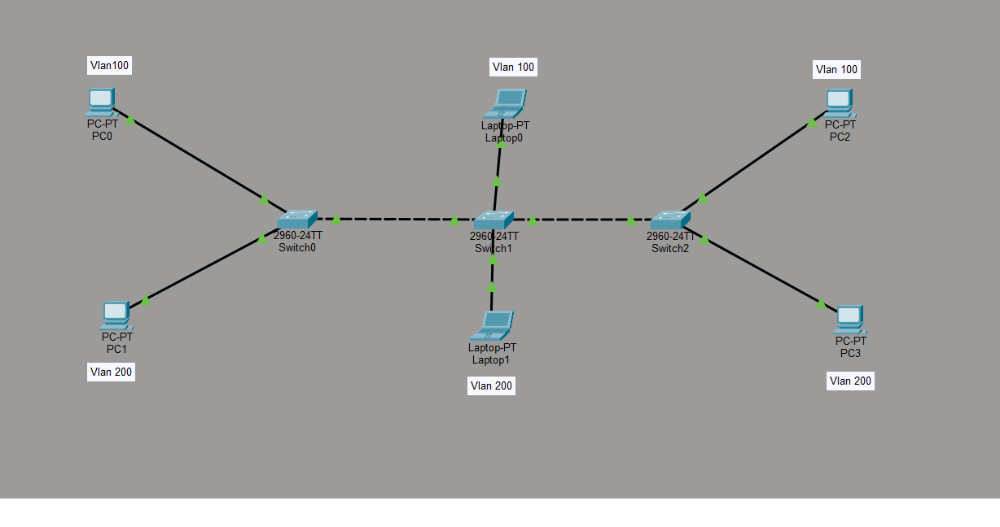

# VLAN & Trunk Ports Lab – Cisco Packet Tracer
##  Lab Topology

---

This repository contains a hands-on lab designed in Cisco Packet Tracer to help understand:

VLAN creation
VLAN assignment to switchports
Trunk link configuration between switches

Lab File: `Trunkports.pkt`

**Devices Used:**
3 Cisco 2960 switches
2 PCs
Proper VLAN assignment and trunking setup between switches

**Configurations Covered**

VLANs 10 and 20 created on all switches
Access ports configured per VLAN:

  interface FastEthernet0/1
  switchport mode access
  switchport access vlan 10
  
**Trunk port configuration:**

  interface FastEthernet0/24
  switchport trunk encapsulation dot1q
  switchport mode trunk
